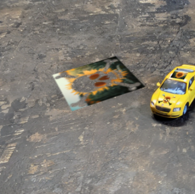
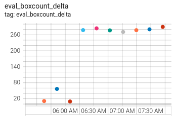
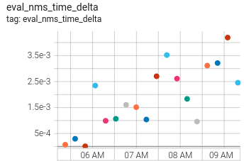
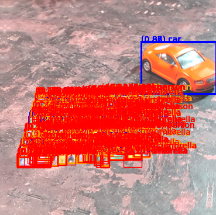

# `electricmayhem` tutorials

## `01_quickstart.ipynb`

This notebook walks through a simple example; training a set of black-and-white patches on a toy car. The goal is to hide it from a YOLO model trained on MSCOCO.

## `02_overview_of_create_stages.ipynb` 

Tools for preprocessing a patch before implanting- such as resizing, stacking channels, or soft-proofing.

## `03_overview_of_implant_stages.ipynb`

Tools for differentiably pasting a patch into an image.

## `04_overview_of_compose_stages.ipynb`

Tools for applying differentiable augmentations and perspective tilting:

## `05_overview_of_infer_stages.ipynb`

Mostly an explanation of how the code handles different YOLO model types.

## `06_ensembles_and_transfer_attacks.ipynb`

Train a patch using an ensemble of two models, then evaluate how well it transfers to a third model.

## `07_bayesian_optimization.ipynb`

Let's try to turn the attack from CVPR2024's *Overload: Latency Attacks on Object Detection for Edge Devices* by Chen *et al* into a physical patch attack. "Overload" exploits the quadratic scaling of non-maximum suppression to try and slow the postprocessing phase of inference down by generating a lot of overlapping detections.

If we want to optimize on the NMS wall time, one approach would be to use that as an objective for Bayesian optimization. For this initial test, the optimization approach increases the number of boxes and NMS wall time, though probably not enough to be practical:

## `08_???.ipynb`

*COMING SOON*

## `09_???.ipynb`

*COMING SOON*

## `10_extending_electricmayhem.ipynb`

`electricmayhem` is intended to be easy to customize! Every pipeline stage inherits from a `PipelineBase` class; this notebook walks through how to subclass `PipelineBase` to make your own bespoke stage.

