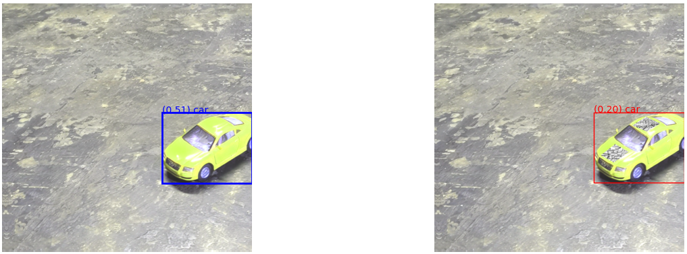

# `electricmayhem` tutorials

## `01_quickstart.ipynb`

This notebook walks through a simple example; training a set of black-and-white patches on a toy car. The goal is to hide it from a YOLO model trained on MSCOCO.

